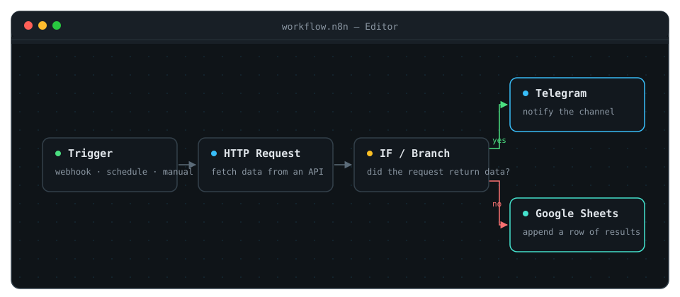
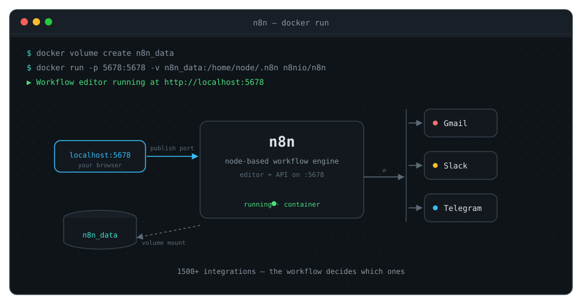

I've been seeing n8n everywhere lately — in YouTube thumbnails, in self-hosting threads, in "automation" discussions. So I did what I usually do: stopped skimming and dug in. This is honest notes-from-exploring, not an expert guide. If you're learning cloud and automation too, it should save you some time.

## What n8n actually is

n8n (pronounced "n-eight-n", short for **nodemation**) is a **workflow automation platform**. Instead of writing glue code between apps, you build a flow on a visual canvas: something triggers the workflow, nodes do the work, and the result lands where you want it.

A few facts that matter:

- **It's fair-code, not fully open-source.** The source is visible and you can self-host it for free, but it's distributed under the Sustainable Use License — you can use it, even sell things built with it, but not resell it as a competing SaaS. That's a deliberate middle ground, and worth knowing before you adopt any tool.
- **It's big.** The current pitch is "AI agents and workflow automation," with **1,500+ integrations** and **9,000+ templates**. You'll struggle to find an app it can't talk to.
- **Code is a first-class citizen.** Nodes are just steps, and any node can run JavaScript or Python — so it scales past drag-and-drop when a flow gets genuinely tricky.

## The mental model: trigger → nodes → output

This is the part that clicked for me. Everything in n8n is a **workflow**, and every workflow is a chain of **nodes**:

- A **trigger** starts the workflow — a webhook, a schedule, a new row in a sheet, an incoming email.
- **Nodes** are the steps — each does one thing: fetch data, transform it, call an API, send a message.
- The last node is usually the **output** — a notification, a database write, an app action.

The clever bit is that nodes **branch and connect** like a pipeline. One input can fork into "if yes, do X" and "if no, do Y" — the control flow you'd normally write as an `if/else` in code, but visible and inspectable.



If you've built CI/CD pipelines, this feels familiar fast. A workflow is just a pipeline with a visual editor and a million pre-built steps.

## Why it's interesting for a cloud/DevOps student

Three reasons, in honest order:

**1. It's a real self-hosting exercise.** You can run n8n yourself in one container:

```bash
docker volume create n8n_data
docker run -it --rm --name n8n -p 5678:5678 \
  -v n8n_data:/home/node/.n8n docker.n8n.io/n8nio/n8n
```

Then open `http://localhost:5678` and you have a full workflow editor. That single command touches volumes, ports, images, and containers — the exact vocabulary I'm learning. It's a complete mini-deployment on your laptop.



**2. The "automate the boring glue" mindset is genuinely useful.** Cloud work is full of glue: "when X happens, do Y, then tell someone." n8n makes you design that as a flow, and thinking in flows carries over to writing better scripts and designing better pipelines.

**3. AI is front-and-center now.** You can plug OpenAI, Anthropic, Google, or open-source models in as nodes — same workflow, swapped provider. For a student watching the AI + ops space, that's a low-friction playground.

## The honest ceiling

n8n is a tool, not a substitute for understanding. Everything it does, you can do with a script and `cron` — and sometimes you should. For small, single-purpose glue, plain code is simpler and more portable. n8n wins when there are many steps, many services, and a GUI that makes the flow inspectable.

It also has a learning curve of its own. "No-code" doesn't mean "no thinking" — you still need to understand APIs, auth, data shapes, and failure modes. But that's exactly the part worth learning.

## What I'm planning next

I'm not going to claim I've built a big n8n thing yet — I haven't. The plan is small and concrete: self-host it with the Docker command above, then automate something I actually do — probably a notification workflow that watches something and posts to a channel. When it's real, I'll write about the build the way I wrote about MessMate and this site's CI/CD.

If you're also learning: go spin it up. One container, zero cost, and the fastest way to understand automation is to automate something small.
